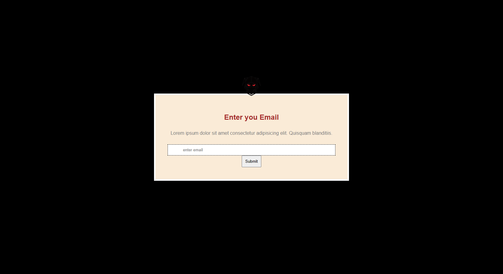
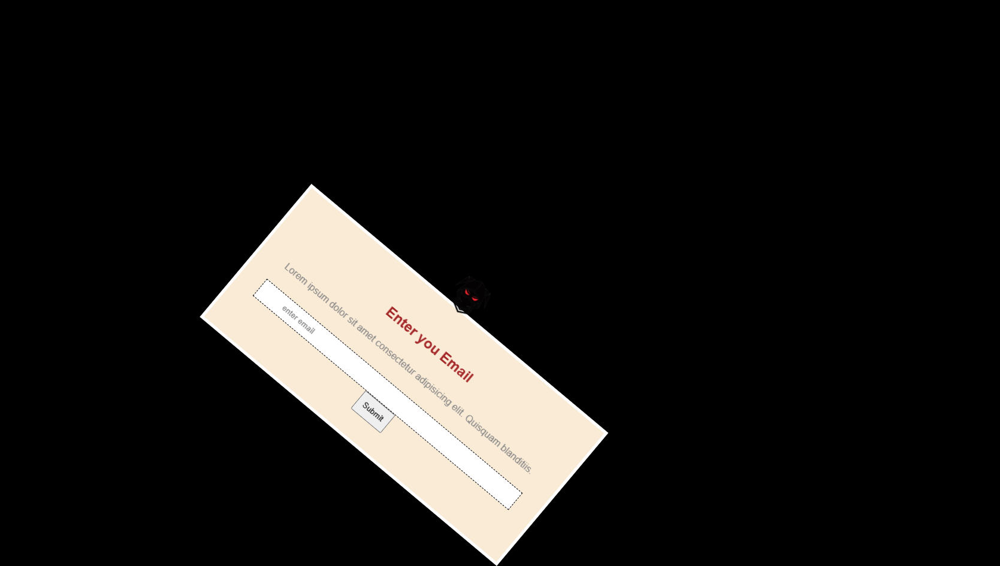

# 🥷 CSS Popup Animation

A modern popup animation built entirely with **HTML5** and **CSS3**. This project demonstrates how powerful CSS animations can be by creating a smooth dropping and swinging popup effect without using a single line of JavaScript.

## 🌐 Live Demo

Once deployed with GitHub Pages, add your live project link here:

DEMO: https://usmanpersonalmail2025-spec.github.io/popUp-Animation/

---

## 📸 Preview

#before animation



#after animations



---

## ✨ Features

- 🎨 Clean and modern popup design
- 🥷 Decorative ninja illustration
- 🎬 Smooth drop animation
- 🎯 Swing animation using `transform-origin`
- 📱 Responsive layout
- ⚡ Built with pure HTML and CSS
- ❌ No JavaScript required

---

## 🛠️ Technologies Used

- HTML5
- CSS3
- CSS Flexbox
- CSS Keyframe Animations
- CSS Transforms
- Media Queries

---

## 📂 Project Structure

```text
popUp-Animation/
│
├── images/
│   └── ninja.png
│
├── index.html
├── popUp.css
└── README.md
```

---

## 🎬 Animations

This project includes two CSS keyframe animations:

### 📥 Drop Animation

The popup enters the screen with a bouncing drop effect.

```css
@keyframes drop;
```

### 🎯 Swing Animation

After dropping, the popup swings naturally using the `transform-origin` property.

```css
@keyframes swings;
```

---

## 📱 Responsive Design

The popup is responsive and adapts to different screen sizes using CSS media queries.

---

## 🚀 Getting Started

### Clone the repository

```bash
git clone https://github.com/usmanpersonalmail2025-spec/popUp-Animation.git
```

### Open the project

```bash
cd popUp-Animation
```

Open `index.html` in your preferred web browser.

No installation or dependencies are required.

---

## 💡 What I Practiced

This project helped me improve my understanding of:

- CSS Keyframe Animations
- `transform`
- `transform-origin`
- Flexbox
- Absolute & Relative Positioning
- Responsive Design
- CSS Media Queries
- CSS Timing Functions (`ease`)
- Animation Delays
- Building UI animations without JavaScript

---

## ⭐ Support

If you found this project helpful or inspiring, consider giving it a ⭐ on GitHub.

---

## 👨‍💻 Author

**Usman Khan**

Learning and building modern web interfaces with HTML, CSS, JavaScript, React, Node.js, Express.js, and MongoDB.

Happy Coding! 🚀
